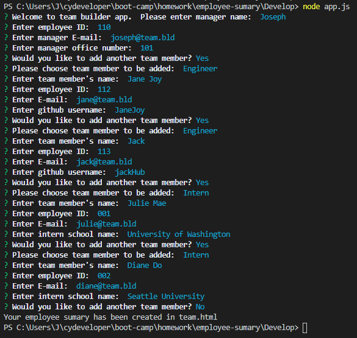
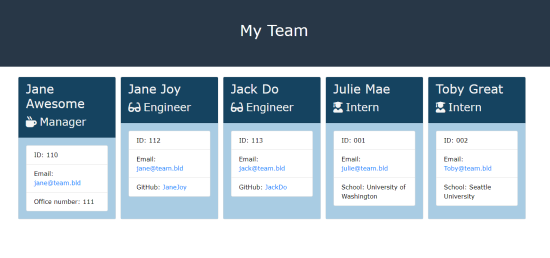

# Employee Summary Generator

## Description 

This application help user generates an employee summary of their team member in a form of html page.   Using command-line application that runs with Node.js, guides user through prompts of questions and options, Based on user's input and selected options, team.html dynamically generated. User can enter as many members desired.

## Installation
### Steps required:
In the terminal mode, user must first run __npm install__ to have its package dependecies. Then, user can run the app.js file in Node environment by running __node app.js__.

## Usage 
### Demo of Employee Summary Generator:

* Link to preview demo: https://drive.google.com/file/d/1NcHqB_Dkfb579NC9xfOtkxRR5Cmb6BCc/view

### Still images preview:
* User is presented with a series of questions such as Name, ID, E-mail and Role-specific property (office number, GitHub profile, or name of school)
* 
* Once all questions are answered and no additional team added, then a team.html file is generated with the following preview:
* 
* The example of Employee Summary page can be access in this path: /Develop/output/team.html

## License
 

## MAINTAINER 
This is an individual assignment created by Carolina Yoedhana.
* GitHub Link: https://github.com/CarolinaYo/employee-sumary.git
